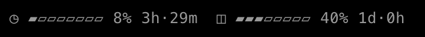
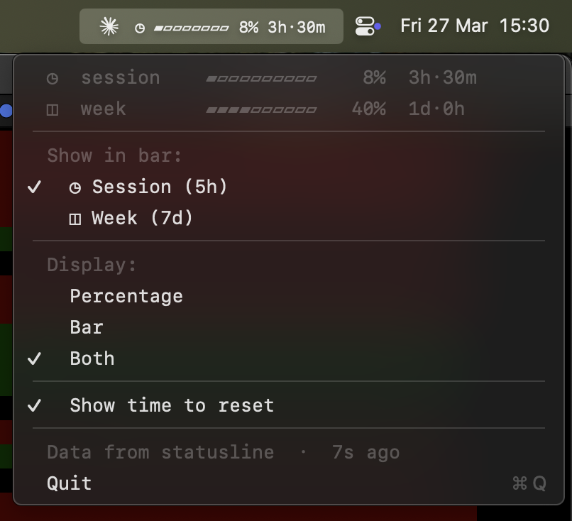

# Claude Gauge

Track your Claude Code usage quotas in real time. No daemons, no extra API calls.

## Install as plugin (recommended)

```bash
claude plugin install --source github:zkfrov/claude-gauge
```

That's it. The statusline activates automatically. Works on macOS, Linux, and WSL.



## Manual setup

If you prefer not to use the plugin system:

1. Download the script:

```bash
curl -o ~/.claude/statusline.sh https://raw.githubusercontent.com/zkfrov/claude-gauge/main/scripts/statusline.sh
chmod +x ~/.claude/statusline.sh
```

2. Add to your `~/.claude/settings.json`:

```json
{
  "statusLine": {
    "type": "command",
    "command": "~/.claude/statusline.sh"
  }
}
```

### What it shows

```
◧ ▰▱▱▱▱▱▱▱ 8% 64K/1M  ◷ ▰▰▰▰▰▱▱▱ 68% 35m  ◫ ▰▰▰▱▱▱▱▱ 39% 4d·6h
```

- `◧` Context window — percentage, bar, and token counts
- `◷` Session (5h window) — percentage, bar, and countdown to reset
- `◫` Week (7d window) — percentage, bar, and countdown to reset

Updates automatically after every Claude response.

### Configuration

Create `~/.claude-gauge/config.json` to customize the statusline. All fields are optional — defaults are used for anything omitted.

```json
{
  "show": ["context", "session", "week"],
  "tokens": true,
  "style": "blocks",
  "icons": "default"
}
```

| Field | Description | Default |
|-------|-------------|---------|
| `show` | Array of sections to display, in order | `["context", "session", "week"]` |
| `tokens` | Show token counts (e.g. `64K/1M`) next to context | `true` |
| `style` | Bar style | `"blocks"` |
| `icons` | Icon set | `"default"` |

#### Bar styles

| Style | Preview |
|-------|---------|
| `blocks` | `▰▰▰▰▰▱▱▱` |
| `classic` | `█████░░░` |
| `dots` | `●●●●●○○○` |
| `thin` | `━━━━━───` |
| `ascii` | `#####···` |
| `arrows` | `▸▸▸▸▸▹▹▹` |

#### Icon sets

| Icons | Context | Session | Week |
|-------|---------|---------|------|
| `default` | ◧ | ◷ | ◫ |
| `emoji` | 🧠 | ⏱ | 📅 |
| `clocks` | ◔ | ◑ | ◕ |
| `letters` | C | S | W |
| `minimal` | · | · | · |
| `ascii` | [c] | [s] | [w] |
| `nerd` |  |  |  |
| `none` | _(no icon)_ | _(no icon)_ | _(no icon)_ |

#### Examples

Only context and session, no week:

```json
{ "show": ["context", "session"] }
```

Classic style with emoji icons, no token counts:

```json
{ "style": "classic", "icons": "emoji", "tokens": false }
```

## macOS menu bar app

A native menu bar widget that feeds off the statusline hook data, so you can see your usage at a glance even when you're not in a Claude session.



```bash
git clone https://github.com/zkfrov/claude-gauge.git
cd claude-gauge
./install.sh
~/.claude-gauge/claude-gauge &
```

Click to see full details, toggle what's shown, and change display format.

Auto-start on login: System Settings > General > Login Items > add `~/.claude-gauge/claude-gauge`

## How it works

Claude Code passes `rate_limits` and `context_window` data to statusline scripts on every response. The hook:

1. Displays usage bars at the bottom of your terminal
2. Caches the data to `~/.claude-gauge/data.json`

The macOS menu bar app reads this cache file — no extra API calls, no background processes.

```
Claude Code response
  → statusline hook runs (built into Claude Code, zero cost)
  → displays bars in terminal
  → writes ~/.claude-gauge/data.json

macOS menu bar app (optional)
  → reads data.json every 5s
  → ticks countdown every 60s
  → shows 0% automatically after a quota reset
```

## Requirements

- [Claude Code CLI](https://docs.anthropic.com/en/docs/claude-code) installed and authenticated
- `jq`

**Menu bar app additionally requires:**
- macOS 15+
- Xcode Command Line Tools (`xcode-select --install`)

## Install options

| Method | What you get | Platform |
|--------|-------------|----------|
| Plugin install | Statusline (auto-configured) | Any |
| [Manual setup](#manual-setup) | Statusline (manual config) | Any |
| `./install.sh --hook` | Statusline (via script) | Any |
| `./install.sh` | Statusline + menu bar app | macOS |

## Menu bar settings

| Setting | Options | Default |
|---------|---------|---------|
| Show in bar | Session (5h), Week (7d) | Session |
| Display format | Percentage, Bar, Both | Both |
| Time to reset | On/Off | On |

All settings are in the dropdown. Preferences persist in `~/.claude-gauge/prefs.json`.

## Uninstall

```bash
# If installed as plugin:
claude plugin uninstall claude-gauge

# If installed via install script:
./install.sh --uninstall

# If installed manually:
rm ~/.claude/statusline.sh
rm -rf ~/.claude-gauge
# Remove the "statusLine" field from ~/.claude/settings.json
```

## License

MIT
